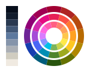
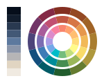

# Tundra

Tundra is both a palette and a collection of colour schemes inspired by the
arctic tundra and the alpine landscapes of northern Scandinavia (as well as the
fantastic palettes [Solarized](https://ethanschoonover.com/solarized) and
[Nord](https://www.nordtheme.com)). It features a blueish grey to pale
yellowish orange base gradient with slightly muted accents and has the goal of
being relaxing for the eyes as well as the mind.

The accents form a 12-colour RYB colour wheel derived from CIE L*c*h° gradients
between a small number of hand-picked colours (red, yellow, green and blue, to
be specific). Each accent colour also has a light and a dark variant, derived
from specific lightness and chroma relations. All in all, this makes for a
whopping 36 accent colours, not all of which should be used at the same time.
The colour schemes primarily use the medium shades.

## Status

The project is currently a work in progress. The initial version of the palette
is ready, but minor adjustments are still to be expected. Colour presets for
Xfce Terminal are available and work on schemes for vim and neovim is in
progress. These will serve as references for other editor and IDE themes.

## Accent Colors

### Cloudberry

                L       c       h
yellow: #fdc722 82.833  79.701  85.822 *
amber:  #ffa91c 75.899  78.686  73.653
orange: #fe8427 67.817  77.66   58.381

### Lingonberry

red:    #e72056 50.332  76.37   17.112  *
green:  #4d842d 49.821  52.792  130.641 *
chartr: #6e9826 57.952  60.739  121.333

### Gentia

blue:   #4265fe 49.032  88.663  296.192 *

### Arctic Raspberry

magenta #b64ab0 49.471  65.961  329.137

violet
purple
pink
